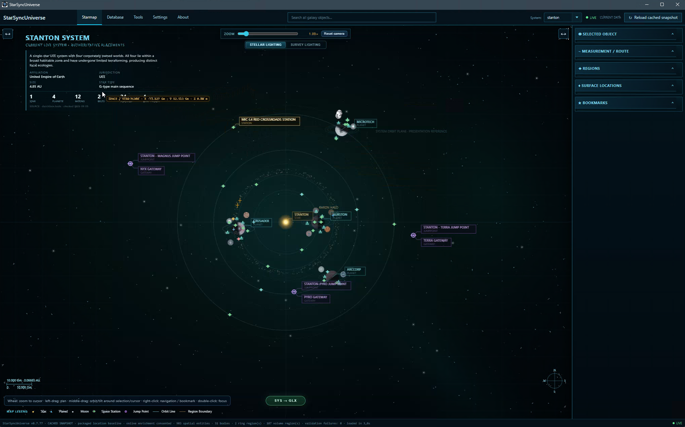
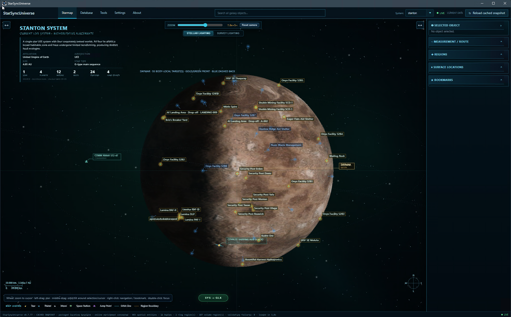
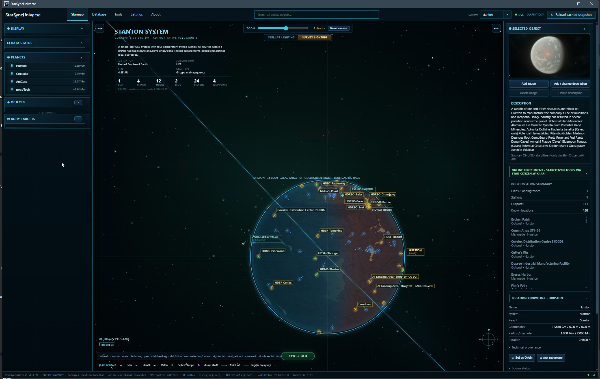
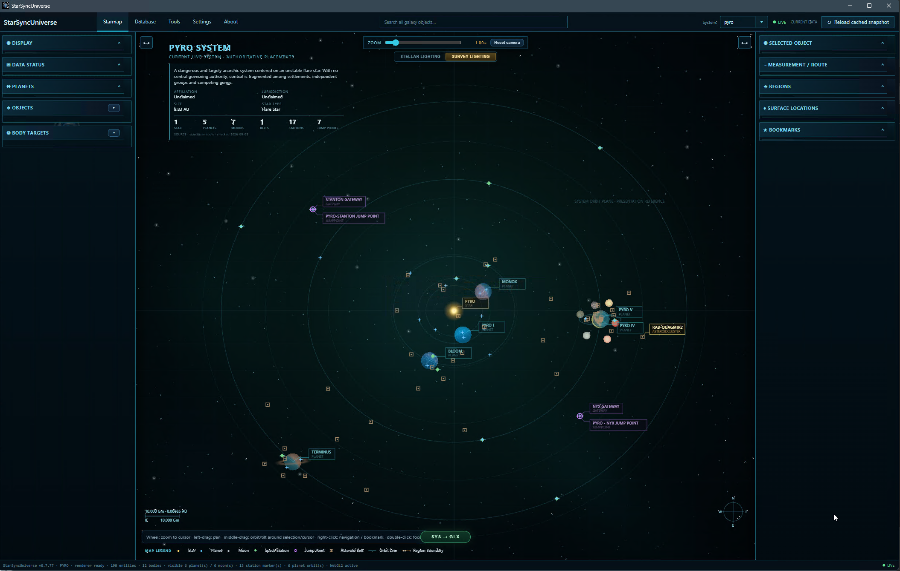
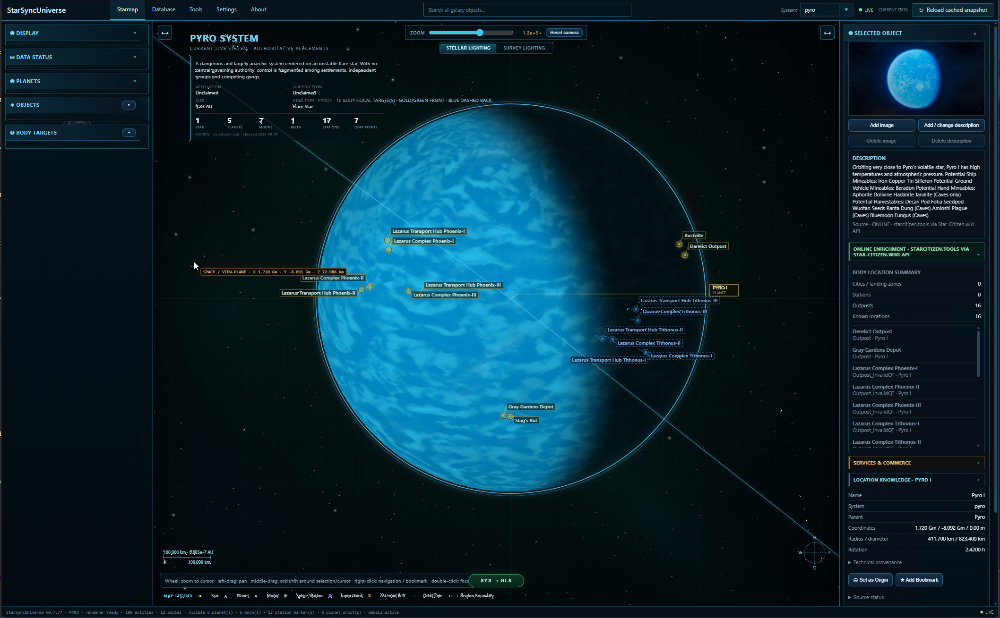

# StarSync Universe

**StarSync Universe** is an interactive, standalone universe map and spatial exploration tool for **Star Citizen**. It turns star systems, planets, moons, orbital infrastructure, jump points, surface locations and navigation data into one continuous map that can be explored from a whole-system overview down to individual moons, stations and body-local targets.

The goal is not to provide another list of locations. StarSync Universe is designed to show **where objects are, how they relate to each other, how large the distances are, and how the surrounding system is structured**.

Current public release: **0.7.77**

> StarSync Universe is a free, unofficial community project and is not affiliated with Cloud Imperium Games or Roberts Space Industries.

## What StarSync Universe does

StarSync Universe presents the Star Citizen universe as an interactive spatial map. The current community baseline includes **Stanton, Pyro and Nyx** and can be used without a local Star Citizen data extraction. Optional adapters can refresh or enrich the packaged baseline with local game data and community data sources.

The map combines a metric spatial core with a GPU-accelerated presentation layer. Planets and moons are rendered as textured bodies, orbital objects retain their parent-body context, and surface locations can be inspected directly on the corresponding celestial body.

### Explore systems at multiple scales

- Navigate complete star systems with planets, moons, stations, jump points, asteroid regions and other spatial objects.
- Zoom continuously from the system overview into planetary and lunar orbital space.
- Keep orbital context while focusing stations and infrastructure such as Comm Arrays or GrimHEX.
- Switch between the system map and the wider galaxy/system-selection view.
- Use an optional illustrated overview for readability when zoomed far out; the presentation blends back toward true projected spacing as the map is inspected more closely.

### Detailed celestial-body presentation

- WebGL2-rendered planets and moons with packaged presentation textures.
- Surface relief, normal-map detail, atmospheric presentation and supported cloud layers.
- **Stellar Lighting** for directional day/night presentation from the system star.
- **Survey Lighting** for complete surface visibility during inspection.
- Optional Survey night-side projection filter with a cyan/teal scan appearance and progressive depth shading on the side facing away from the star.
- Body radius, diameter, rotation information and spatial coordinates where available from the current data model.

### Locations, stations and surface targets

- Inspect stations, outposts, landing zones, racing locations, navigation markers and other mapped objects.
- Select surface locations directly from body summaries and move the camera to the corresponding target.
- Front- and far-side body-local targets remain distinguishable in the body overlay.
- Object details can include readable descriptions, parent relationships, services, commerce/location knowledge and technical provenance.
- User-supplied local descriptions and images can be stored as presentation overrides without modifying the source dataset.

### Search, filters and navigation

- Global object search across the loaded universe data.
- Visibility controls for stars, planets and moons, stations, jump points, asteroid fields, racing tracks, labels, regions and hidden objects.
- Service-oriented filters for supported station and surface capabilities.
- Double-click focus, smooth camera travel, zoom-to-cursor, camera orbit and reset controls.
- Persistent map/display settings between application sessions.

### Measurement and routing

- Spatial measurement directly on the map.
- Distance display in **metric units and astronomical units (AU)**.
- Start/destination workflow from the map context menu.
- Multi-segment in-system and inter-system route presentation.
- Reciprocal jump connections between supported systems.
- StarSync Universe deliberately avoids inventing unsupported interstellar metric distances where the underlying data does not provide an authoritative value.

### Bookmarks and personal map knowledge

- Create bookmarks from mapped objects or arbitrary map coordinates.
- Organize bookmarks into groups.
- Show or hide saved markers on the map.
- Preserve stable identifiers and coordinate context for later navigation and sharing workflows.

## Screenshot gallery

The public README is prepared for five screenshots. Add the images below to `docs/screenshots/` and uncomment the matching Markdown lines in this section. Recommended subjects and captions are documented in `docs/SCREENSHOT_PLAN.md`.

### 1. Stanton system overview


### 2. Moon and orbital infrastructure


### 3. Survey Lighting and night-side projection


### 4. Pyro system overview


### 5. Surface locations and object details


## Spatial accuracy and presentation

StarSync Universe keeps the spatial and presentation layers separate. Coordinates, body-local frames, physical radii and measurable distances are handled by the .NET spatial core, while the WebGL/Canvas renderer is responsible for visual presentation.

This allows the application to preserve source-derived spatial relationships while still providing readable labels, body textures, lighting modes and overview aids. The optional illustrated system overview may enlarge or separate small local objects when the map is extremely zoomed out; this is a presentation aid rather than a replacement for the underlying coordinates.

## Data model and source priority

The application distinguishes between authoritative/local spatial data, packaged community data, enrichment and derived presentation values:

1. Packaged StarSync Universe community baseline for immediate standalone use.
2. Optional current local `Data.p4k` refresh through StarBreaker.
3. Optional SCUnpacked enrichment and identity/metadata validation.
4. Derived spatial and presentation values.
5. Optional external community sources for metadata/media enrichment when explicitly enabled.

Technical source information is retained for diagnostics and provenance, but normal user-facing labels are intended to show readable object and location names rather than raw source identifiers.

## Download and run

A prepared Windows release package is generated in `release/`. The binary ZIP is intended to be uploaded as a **GitHub Release asset** and is ignored by source Git; `release/CHECKSUMS.txt` remains available for integrity verification.

Requirements for the framework-dependent public build:

- Windows 10/11 x64
- Microsoft WebView2 Runtime
- .NET 10 Desktop Runtime

Start `StarSyncUniverse.exe`. The packaged community baseline is sufficient for normal standalone exploration.

Optional local-data refresh can be configured from **Settings**. A local StarBreaker executable, Star Citizen `Data.p4k` and/or an SCUnpacked dataset are not required for the normal packaged baseline.

## Build from source

Requirements:

- Windows 10/11 x64
- .NET SDK 10.0 or newer compatible SDK
- Microsoft WebView2 Runtime

Build the solution:

```powershell
dotnet restore
dotnet build StarSyncUniverse.slnx -c Release
```

Create the copyable Windows package:

```powershell
.\scripts\publish-win-x64.ps1
```

More information is available in `docs/BUILDING.md` and `docs/ARCHITECTURE.md`.

## Repository layout

```text
StarSync-Universe/
|-- src/
|   |-- StarSyncUniverse/            application, renderer, spatial data and services
|   `-- StarSyncUniverse.Contracts/  public catalog/API contracts
|-- database/                        optional local SCUnpacked input area
|-- docs/                            architecture, usage and publication documentation
|-- scripts/                         build/publish and export helpers
|-- release/                         prepared Windows release package
|-- LICENSE
|-- THIRD_PARTY_NOTICES.md
|-- CONTRIBUTING.md
|-- SECURITY.md
|-- CHANGELOG.md
`-- README.md
```

## Community projects and credits

StarSync Universe benefits from the work of several Star Citizen community projects:

- [SCUnpacked Data](https://github.com/StarCitizenWiki/scunpacked-data) — optional local metadata, identity and validation data.
- [Star Citizen Wiki API](https://api.star-citizen.wiki/) / [API source](https://github.com/StarCitizenWiki/API) — optional structured metadata and media enrichment.
- [StarCitizen.Tools](https://starcitizen.tools/) — optional reference descriptions, media and visual reference material.
- **StarBreaker** — optional local `Data.p4k` extraction and inspection bridge used by the refresh workflow.

See `THIRD_PARTY_NOTICES.md` for attribution and licensing boundaries.

## Privacy and game-client boundary

StarSync Universe is a companion application. Normal standalone use reads its packaged baseline and local application data. Optional external HTTP enrichment is explicitly gated by user settings. Optional local refresh reads configured files through the supported StarBreaker workflow.

The application does not need to inject into the Star Citizen process to display the map.

## Support

StarSync Universe is free software and is intended to remain free. If the project is useful to you and you want to support continued development, testing and future Star Citizen compatibility work, voluntary support is welcome.

There are no paid feature locks implied by this support link.

## License

The original StarSync Universe source code in this repository is licensed under **GNU GPL-3.0-or-later**. Third-party libraries, community datasets, trademarks and external/game-derived reference material retain their own licenses and terms and are not relicensed by this project.

See `LICENSE` and `THIRD_PARTY_NOTICES.md`.

## Disclaimer

This is an unofficial fan-made project and is not affiliated with, endorsed by, or sponsored by Cloud Imperium Games or Roberts Space Industries. Star Citizen and related names, trademarks and game content belong to their respective owners.
